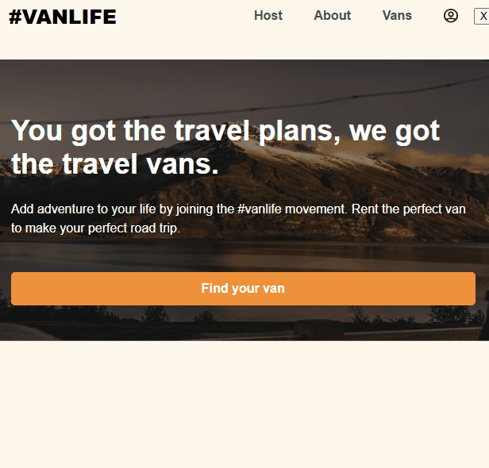

# 🚐 VanLife App

A single-page React web app simulating a platform for renting vans. This project was built to practice React Router concepts, handling protected routes, authentication, and dynamic search functionality.

The app is designed as a learning project following the Scrimba Frontend Career Path curriculum.

The website is deployed and hosted on Netlify. You can check out the live demo here: https://vanlife-egeto.netlify.app/

## ⚙️ Features

- Browse available vans and view detailed information about each.
- Log in as a host to manage your own listed vans.
- Protect host routes so only authenticated users can access them.
- Maintain search filter state across pages.
- Load data asynchronously with error handling.

## 🧠 Concepts and Skills Applied

### 🛤️ React Router

- **Nested Routes**: Pages like `host/vans/:id` display subpages inside the host dashboard layout.
- **Dynamic Routes**: Access dynamic van details using URL parameters like `/vans/:id`.
- **Protected Routes**: Prevent unauthenticated users from accessing certain pages by redirecting them to the login page.

### 🧹 Data Loading with Loaders

- **Loader Functions**: Used to fetch data _before_ the component renders, providing a better user experience.
- **Error Handling**: Errors during data loading are gracefully caught and displayed using error elements.

### 🔍 Search Parameters

- **Preserve Search State**: Implemented URL search parameters (like `?type=simple`) to filter vans and preserve the filter when navigating back and forth between pages.

### 🔒 Authentication System

- **Login Form**: Simple login form handling user credentials.
- **Persistent Login State**: Redirects users back to their intended destination after logging in.
- **Error Feedback**: Displays error messages when login fails due to incorrect credentials.

### 🗂️ Firebase Integration

- **Authentication**: Uses Firebase Authentication for user login management.
- **Firestore Database**: Retrieves van and host van data directly from Firebase Firestore instead of a mock server.

### 🔄 UI and State Management

- **Controlled Forms**: Manages form inputs with React's `useState`.
- **useLoaderData**: Synchronizes component states with loader-fetched data.

## 🛠️ Tools and Technologies

- React
- React Router
- Firebase Authentication
- Firestore Database
- Vite (for fast development)

## 🖼️ Screenshot

